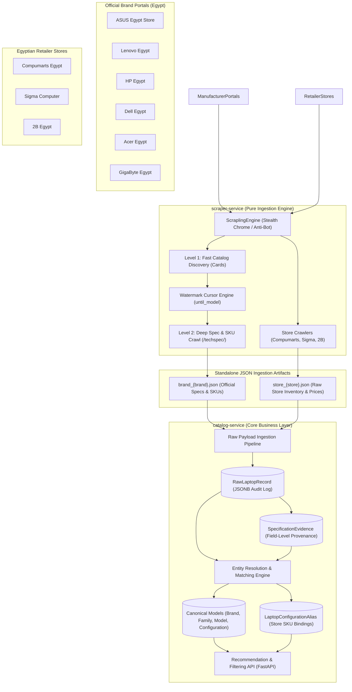
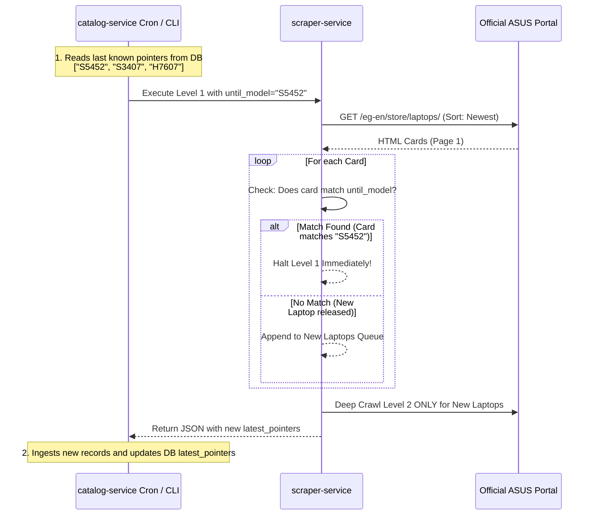

# System Architecture & Technical Specifications

This document defines the high-level architecture, design decisions, data models, and operational patterns of the **Laptop Recommender System** for the Egyptian market.

---

## 1. High-Level System Architecture

The system enforces a strict decoupling between **data ingestion (`scraper-service`)** and **relational catalog management & recommendation (`catalog-service`)**:



---

## 2. Decoupled Ingestion vs Catalog Matching Philosophy

### Why Remove Matching from the Scraper?
1. **Separation of Concerns**: Scraping is inherently I/O-bound, network-dependent, and anti-bot-sensitive. Coupling entity matching with crawling makes scraping brittle, slow, and hard to test.
2. **Stateless vs Stateful**: The scraper service is completely stateless and produces clean, isolated JSON artifacts. The matching engine requires database state (canonical models, aliases, historical SKU records, existing hardware specs).
3. **Idempotence & Re-Processing**: By storing raw payloads in `RawLaptopRecord` (PostgreSQL `JSONB`), we can refine, re-run, or backfill matching algorithms without re-scraping the web or triggering anti-bot rate limits.
4. **Auditability**: `SpecificationEvidence` records every extracted field with source URLs, collection timestamps, and confidence scores, providing complete data provenance.

---

## 3. The 4-Tier Product Hierarchy

A critical design rule of this system is that **distinct hardware configurations must never be merged under a loose parent model**.

The logical hierarchy is strictly structured as follows:

```
Brand (e.g., ASUS)
  ↓
LaptopFamily (e.g., Vivobook, ROG Strix, Zenbook)
  ↓
LaptopModel (e.g., ASUS Vivobook S14 (S5452))
  ↓
LaptopConfiguration (e.g., S5452MA-QD045W)
  ├── Canonical Components (CPU, GPU, Display, RAM, Storage, Battery, Ports)
  └── Retail Offers via LaptopConfigurationAlias (Compumarts, Sigma, 2B)
```

### Concrete Hierarchy Example:
```text
ASUS
└── Vivobook
    └── ASUS Vivobook S14 (S5452)
        ├── S5452MA-QD045W [Core Ultra 7 258V | 32GB RAM | 1TB SSD | 14" 3K OLED]
        │   ├── Compumarts Offer: 54,999 EGP (In Stock)
        │   └── Sigma Offer: 55,500 EGP (In Stock)
        └── S5452MA-QD044W [Core Ultra 5 226V | 16GB RAM | 512GB SSD | 14" 3K OLED]
            └── 2B Egypt Offer: 47,999 EGP (In Stock)
```

> [!IMPORTANT]
> Retailer offers are linked to canonical `LaptopConfiguration` records via `LaptopConfigurationAlias`. An offer for `S5452MA-QD044W` (Core Ultra 5 / 16GB) must **never** be attached to `S5452MA-QD045W` (Core Ultra 7 / 32GB).

---

## 4. Brand Scraping: Two-Level Ingestion Model

Brand manufacturer scrapers implement a two-level extraction workflow:

* **Level 1 (Listing Overview)**:
  * Reads the official Egypt brand catalog sorted by **Newest** (e.g. `https://www.asus.com/eg-en/store/laptops/`).
  * Extracts card metadata: title, family line, base model code, product overview URL, official price, and thumbnail.
  * Evaluates the **Watermark Pointer (`until_model`)**. If the card matches the pointer, Level 1 halts immediately.
* **Level 2 (Deep Specifications Crawl)**:
  * Traverses each Level 1 summary to its dedicated `/techspec/` page.
  * Converts HTML specifications to clean Markdown via `markdownify`.
  * Extracts distinct physical configurations, sub-model codes (e.g. `S5452MA`), and manufacturer part numbers (MPNs).
  * Extracts deep hardware specs: CPU, GPU, Display, RAM, Storage, I/O Ports, Battery, Weight, and physical colors.

---

## 5. Watermark-Based Incremental Ingestion Pattern

Instead of guessing laptop release dates through fragile HTML publication meta tags or heuristic CPU generation tables, the system uses a **Reverse Watermark Cursor Pattern** (also known as the `since_id` pattern):



### Pointer Matching Mechanics
The `matches_pointer()` function checks whether the watermark matches:
1. **Model Code** (e.g. `S5452` or `S3407`)
2. **Full Name** (e.g. `ASUS Vivobook S14 (S5452)`)
3. **URL Slug** (e.g. `asus-vivobook-s14-s5452`)

### Delisted Model Safeguard
If ASUS unlists or modifies the title of the watermark laptop, the `max_pages` parameter (default: 5) guarantees the scraper never enters an infinite loop, terminating gracefully at the safety boundary.

---

## 6. Engine Abstraction Layer (`app/engine`)

```
IScraperEngine (Abstract Interface)
       │
       ▼
ScraplingEngine (Concrete Scrapling + Stealth Chrome)
       ├── HTTP Mode: FetcherSession with Chrome TLS Fingerprint Impersonation
       └── Headless Mode: StealthyFetcher (Patchright/Playwright) for JS rendering
```

* **`IScraperEngine`**: Defined in [`app/engine/base.py`](file:///d:/Development/Side%20Projects/laptop-recommender/services/scraper-service/app/engine/base.py). Decouples scraping logic from any specific browser automation tool.
* **`ScrapedDocument`**: Standardized response container providing:
  * `.html`: Raw rendered HTML string.
  * `.markdown()`: Clean readable Markdown generated via `markdownify`.
  * `.get_meta(name_or_prop)`: HTML `<meta>` tag extractor.
  * `.get_json_ld()`: Schema.org JSON-LD extractor.
  * `.raw`: Access to underlying parser (`css()`, `xpath()`).

