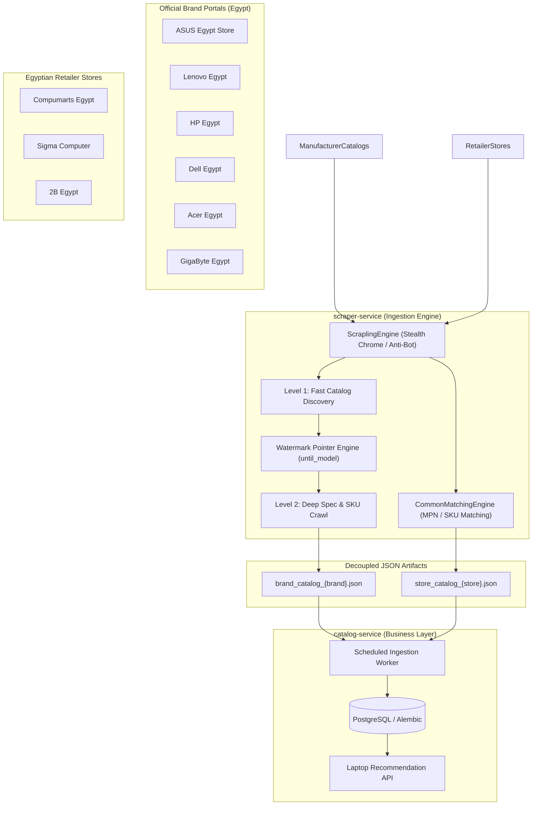
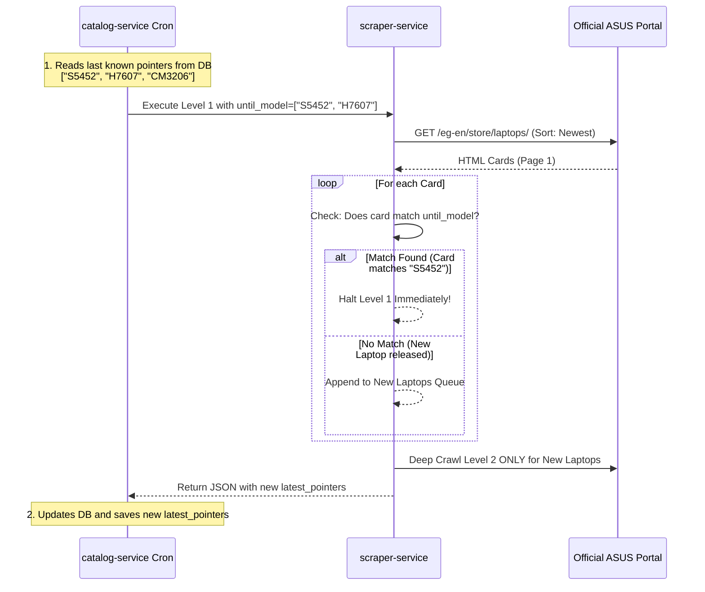

# System Architecture & Technical Specifications

This document defines the high-level architecture, design decisions, data models, and operational patterns of the **Laptop Recommender System**.

---

## 1. High-Level System Architecture

The system decouples **data ingestion (scraping)** from **catalog management and recommendation**:



---

## 2. Architectural Principles

### A. Independent Decoupled Microservices
* **The Scraper Service does not connect directly to the database**.
* Each scraping execution is idempotent and outputs structured standalone JSON documents.
* This guarantees that if a retailer alters its HTML or anti-bot challenge, it does not corrupt the central database or crash the recommendation API.
* The downstream `catalog-service` reads these JSON outputs, verifies differences, and syncs updates.

### B. Two-Level Ingestion Model
* **Level 1 (Listing Overview)**:
  * Reads the brand catalog page sorted by **Newest**.
  * Extracts card metadata: title, family line, base model code, product overview URL, official price, and thumbnail.
  * Evaluates the **Watermark Pointer (`until_model`)**. If the card matches the pointer, Level 1 halts immediately.
* **Level 2 (Deep Specifications Crawl)**:
  * Traverses each Level 1 summary to its dedicated `/techspec/` page.
  * Converts HTML specifications to clean Markdown via `markdownify`.
  * Extracts distinct physical configurations, sub-model codes (e.g. `S5452MA`), and manufacturer part numbers (MPNs).
  * Extracts hardware specs: CPU, GPU, Display, RAM, Storage, I/O Ports, Battery, Weight, and Colors.

---

## 3. The 4-Tier Product Hierarchy

A critical design rule of this system is that **distinct hardware configurations must never be merged under a loose parent model**. 

The logical hierarchy is strictly structured as follows:

```
Brand (e.g., ASUS)
  ↓
Model Family (e.g., ASUS Vivobook S14 (S3407))
  ↓
Exact Configuration / SKU (e.g., S3407AA-SF117W vs S3407CA-LY065W)
  ↓
Retail Offer (Compumarts / Sigma / 2B)
```

### Hierarchy Concrete Example:
```text
ASUS
└── Vivobook S14 (S3407)
    ├── S3407AA-SF117W [Intel Core Ultra 7 155H | 16GB RAM | 512GB SSD]
    │   ├── Compumarts Offer: 48,999 EGP (In Stock)
    │   └── Sigma Offer: 49,500 EGP (In Stock)
    └── S3407CA-LY065W [Intel Core Ultra 5 125H | 8GB RAM | 512GB SSD]
        └── 2B Egypt Offer: 42,999 EGP (Out of Stock)
```

> [!IMPORTANT]
> An offer for `S3407CA-LY065W` must **never** be attached to `S3407AA-SF117W`. If an exact SKU match is impossible, offers fall back to `BASE_MODEL_SPECS` matching only if specifications (CPU, RAM, Display) match with high confidence ($\ge 85\%$).

---

## 4. Watermark-Based Incremental Ingestion Pattern

Instead of guessing laptop release dates through fragile HTML publication meta tags or heuristic CPU generation tables, the system uses a **Watermark Cursor Pattern** (also known as the `since_id` pattern):



### Pointer Matching Mechanics
The `matches_pointer()` function checks whether the watermark matches:
1. **Model Code** (e.g. `S5452` or `H7607`)
2. **Full Name** (e.g. `ASUS Vivobook S14 (S5452)`)
3. **URL Slug** (e.g. `asus-vivobook-s14-s5452`)

### Delisted Model Safeguard
If ASUS unlists or modifies the title of the watermark laptop, the `max_pages` parameter (default: 5) guarantees the scraper never enters an infinite loop, terminating gracefully at the safety boundary.

---

## 5. Engine Abstraction Layer (`app/engine`)

```
IScraperEngine (Abstract Interface)
       │
       ▼
ScraplingEngine (Concrete Scrapling + Stealth Chrome)
       ├── HTTP Mode: FetcherSession with Chrome TLS Fingerprint Impersonation
       └── Headless Mode: StealthyFetcher (Patchright/Playwright) for JS rendering
```

* **`IScraperEngine`**: Defined in [`app/engine/base.py`](file:///d:/Development/Side%20Projects/laptop-recommender/services/scraper-service/app/engine/base.py). Decouples scraping logic from any specific browser automation tool.
* **`ScrapedDocument`**: Standardized response container providing:
  * `.html`: Raw rendered HTML string.
  * `.markdown()`: Clean readable Markdown generated via `markdownify`.
  * `.get_meta(name_or_prop)`: HTML `<meta>` tag extractor.
  * `.get_json_ld()`: Schema.org JSON-LD extractor.
  * `.raw`: Access to underlying parser (`css()`, `xpath()`).
