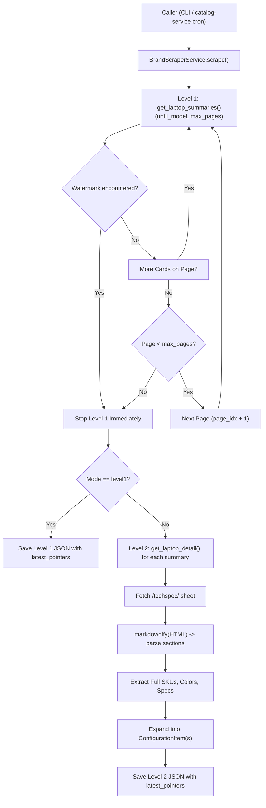

# Brand Scraping Architecture & Implementation Guide

This guide explains the inner mechanics of official brand manufacturer scraping, the `BaseBrandScraper` interface, Level 1 vs Level 2 data extraction, Markdown tech spec parsing, and watermark pointer mechanics.

---

## 1. The Core Lifecycle of a Brand Scraper

Each brand scraper implements the abstract contract defined in [`app/scrapers/base.py`](file:///d:/Development/Side%20Projects/laptop-recommender/services/scraper-service/app/scrapers/base.py):



---

## 2. The `BaseBrandScraper` Contract

Every brand scraper must inherit from `BaseBrandScraper`:

```python
from abc import ABC, abstractmethod
from app.engine.base import IScraperEngine
from app.schemas.laptop import ConfigurationItem, LaptopDetail, LaptopSummary

class BaseBrandScraper(ABC):
    def __init__(self, engine: IScraperEngine):
        self.engine = engine

    @property
    @abstractmethod
    def brand_name(self) -> str:
        """e.g. 'ASUS', 'Lenovo', 'HP', 'Dell', 'Acer', 'GigaByte'"""
        pass

    @property
    @abstractmethod
    def catalog_url(self) -> str:
        """Official Egypt store or listing catalog URL."""
        pass

    @abstractmethod
    def get_laptop_summaries(
        self,
        limit: int | None = None,
        until_model: str | list[str] | None = None,
        max_pages: int = 5,
    ) -> list[LaptopSummary]:
        """Level 1: Scrapes listing cards sorted by Newest with watermark stopping."""
        pass

    @abstractmethod
    def get_laptop_detail(
        self,
        summary: LaptopSummary,
    ) -> LaptopDetail | None:
        """Level 2: Crawls full tech specs sheet. Returns None if placeholder."""
        pass

    def extract_configurations(self, detail: LaptopDetail) -> list[ConfigurationItem]:
        """Expands a LaptopDetail into distinct official physical ConfigurationItems."""
        ...
```

---

## 3. Level 1: Catalog Ingestion & Watermark Halting

In Level 1, the goal is to discover what laptops exist without incurring the overhead of fetching individual spec pages for dozens of items:

1. **Catalog URL Sorting**:
   * Official brand portals for Egypt (e.g. `https://www.asus.com/eg-en/store/laptops/`) default their sort to **"Newest"** (`SortBy=ProductLatest`).
   * Product cards appear in the DOM from newest to oldest.

2. **Watermark Matching (`matches_pointer`)**:
   * Accepts `until_model: str | list[str] | None`.
   * For each product card on the page, the scraper checks:
     ```python
     def matches_pointer(name_str: str, model_code: str | None, url_str: str) -> bool:
         for ptr in pointers:
             ptr_clean = ptr.strip().lower()
             # 1. Model code match (e.g. "S5452", "S3407")
             if model_clean and (ptr_clean == model_clean or ptr_clean in model_clean):
                 return True
             # 2. Full name match (e.g. "ASUS Vivobook S14 (S5452)")
             if ptr_clean in name_clean:
                 return True
             # 3. URL slug match (e.g. "asus-vivobook-s14-s5452")
             if ptr_clean in url_clean:
                 return True
         return False
     ```
   * As soon as a card satisfies `matches_pointer()`, Level 1 prints `[+] Reached Watermark pointer! Halting Level 1 scan.` and **breaks out of the loop immediately**.
   * It never visits subsequent pages or downloads older laptops.

3. **Pagination Safety Ceiling (`max_pages`)**:
   * If `until_model` is not found (e.g. the watermark model was renamed or unlisted), the loop halts at `max_pages` (default: 5) to prevent unbounded crawling.

---

## 4. Level 2: Deep Spec Extraction via Markdown

Many laptop manufacturers publish complex, nested HTML tables for their `/techspec/` pages. Parsing raw table DOMs is fragile because web designers frequently alter `<div>` nesting and CSS class names.

The scraper uses a robust **HTML-to-Markdown parsing strategy**:

### Step 1: Render and Convert
```python
doc = self.engine.fetch(specs_url, stealth=True, network_idle=True, disable_resources=True)
raw_markdown = doc.markdown()
```

### Step 2: Validate Against Placeholders
Unreleased or placeholder pages often have no hardware content or say `"Viewing 0 - 0 of 0"`. The scraper rejects them early:
```python
if re.search(r"viewing\s+\d+\s*-\s*0\s+of\s+0", raw_markdown, re.IGNORECASE):
    return None

core_keys = {"processor", "platform", "operating system", "display", "memory", "storage"}
if not any(k in all_specs.keys() for k in core_keys):
    return None
```

### Step 3: Parse Sections by Known Headers
The scraper scans lines for known specification categories (`Processor`, `Graphics`, `Display`, `Memory`, `Storage`, `I/O Ports`, `Battery`, `Weight`, `Dimensions`, `Color`), collecting values between headers:
```python
def _parse_specs_from_markdown(markdown_text: str) -> dict[str, str]:
    ...
```

### Step 4: Map into Standardized Domain Fields
Using [`extract_structured_specs()`](file:///d:/Development/Side%20Projects/laptop-recommender/services/scraper-service/app/scrapers/asus.py#L208), raw headers are normalized into consistent fields:
* `processor`
* `graphics`
* `display`
* `memory`
* `storage`
* `io_ports`
* `battery`
* `weight`
* `color`

---

## 5. Discovering Exact SKUs & Physical Configurations

A single product page (e.g. `ASUS Vivobook S14 (S3407)`) often encompasses multiple hardware configurations:

```python
# Extract all sub-model SKUs from spec text and store URLs
sku_matches = re.findall(r"\b([A-Za-z]{1,4}\d{3,5}[A-Za-z0-9]{1,4}-[A-Za-z0-9]{4,8})\b", raw_markdown)
# Yields: ['S3407AA-SF117W', 'S3407CA-LY065W']
```

The scraper's `extract_configurations()` creates an independent [`ConfigurationItem`](file:///d:/Development/Side%20Projects/laptop-recommender/services/scraper-service/app/schemas/laptop.py#L136) for each distinct SKU, attaching the exact hardware specs:
```json
{
  "model": "S3407AA-SF117W",
  "model_series": "S3407AA",
  "base_model": "S3407",
  "mpn": "90NB16J1-M00410",
  "official_specs": { ... }
}
```

---

## 6. Standalone Service Orchestration (`AsusScraperService`)

To ensure clean decoupling, each brand has a dedicated service orchestrator (e.g., [`AsusScraperService`](file:///d:/Development/Side%20Projects/laptop-recommender/services/scraper-service/app/services/asus_scraper_service.py)):

* Manages execution flow between Level 1 and Level 2.
* Collects the **top 3 latest laptop full names** into `latest_pointers`:
  ```python
  latest_pointers = [d.name for d in detailed_laptops[:3]]
  ```
* Wraps the results into the top-level schema [`AsusBrandCatalogResult`](file:///d:/Development/Side%20Projects/laptop-recommender/services/scraper-service/app/schemas/laptop.py#L66).
* Saves the output to a standalone JSON file encoded in UTF-8.
