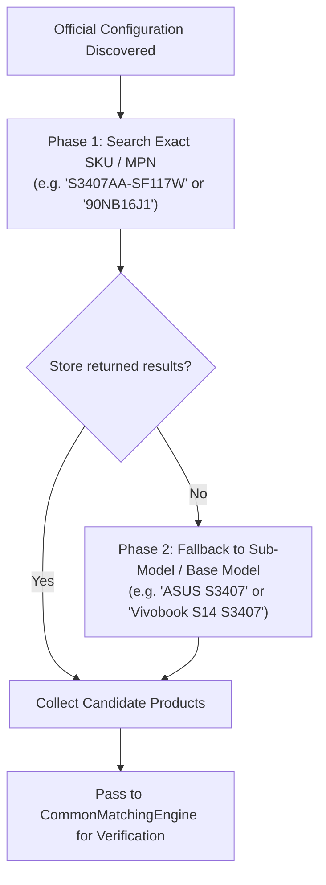

# Retailer Store Scraping & Fuzzy Matching Engine

This document details how the Egyptian retailer store crawlers operate, how targeted search queries are constructed, and how the `CommonMatchingEngine` binds store offers strictly to official configurations.

---

## 1. Supported Egyptian Retailers

Retailer scrapers live in `app/stores/`:

| Store Key | Retailer Name | Base Domain | Scraping Engine |
| :--- | :--- | :--- | :--- |
| `compumarts` | Compumarts Egypt | `https://www.compumarts.com` | Search query + HTML parsing |
| `sigma` | Sigma Computer | `https://www.sigma-computer.com/en` | Search query + HTML parsing |
| `twob` | 2B Egypt | `https://2b.com.eg/ar/` | Search query + bilingual title parser |

Every store inherits from [`BaseStoreScraper`](file:///d:/Development/Side%20Projects/laptop-recommender/services/scraper-service/app/stores/base.py) and is registered in [`app/stores/registry.py`](file:///d:/Development/Side%20Projects/laptop-recommender/services/scraper-service/app/stores/registry.py):

```python
STORE_REGISTRY: dict[str, type[BaseStoreScraper]] = {
    "compumarts": CompumartsStoreScraper,
    "sigma": SigmaStoreScraper,
    "twob": TwoBStoreScraper,
}
```

---

## 2. Two-Phase Targeted Candidate Search

Retailer websites have vastly different internal search algorithms. To avoid crawling millions of unneeded products, [`StoreAggregatorService`](file:///d:/Development/Side%20Projects/laptop-recommender/services/scraper-service/app/services/store_aggregator.py) generates targeted search queries for each discovered official laptop:



---

## 3. The `CommonMatchingEngine` Architecture

The matching engine in [`app/matching/engine.py`](file:///d:/Development/Side%20Projects/laptop-recommender/services/scraper-service/app/matching/engine.py) evaluates retailer product candidates against the official configuration using a **deterministic confidence hierarchy**:

```
Match Priority:
1. MPN Match (Manufacturer Part Number)    ──> 100% Confidence (EXACT)
2. Full SKU Code Match (e.g. S3407AA-SF117W)──>  95% Confidence (EXACT)
3. Sub-Model Series Match (e.g. S3407AA)   ──>  85% Confidence (PROBABLE)
4. Base Model + Specs Match (S3407 + specs)──>  80% Confidence (PROBABLE)
5. Mismatch / Incompatible Specs           ──>   0% Confidence (REJECTED)
```

### Deterministic Rejection Rules

A candidate is **REJECTED immediately** if:
1. **Chassis Mismatch**: Retailer is selling `S5452` while configuration is `S3407`.
2. **Sub-Model Conflict**: Retailer is selling `S3407CA` (Intel Core Ultra) while the target configuration is `S3407AA` (Snapdragon).
3. **Hardware Incompatibility**:
   * Processor platform mismatch (e.g. target is `Snapdragon X Elite`, store title contains `Intel Core Ultra 7 155H`).
   * RAM capacity mismatch (e.g. target is `16GB`, store offers `8GB`).
   * Screen size mismatch (e.g. target is `14-inch`, store offers `16-inch`).

### Strict Configuration Binding

Once a candidate passes matching verification, it is wrapped in a [`RetailOffer`](file:///d:/Development/Side%20Projects/laptop-recommender/services/scraper-service/app/schemas/laptop.py#L105) and attached **only to its matching [`ConfigurationItem`](file:///d:/Development/Side%20Projects/laptop-recommender/services/scraper-service/app/schemas/laptop.py#L136)**:

```json
{
  "model": "S3407AA-SF117W",
  "base_model": "S3407",
  "stores": [
    {
      "store_name": "Compumarts",
      "store_domain": "compumarts.com",
      "title": "ASUS Vivobook S14 S3407AA-SF117W Snapdragon X Elite 16GB 512GB",
      "price_egp": 48999.0,
      "in_stock": true,
      "match_status": "EXACT",
      "match_method": "FULL_SKU",
      "match_confidence": 0.95
    }
  ]
}
```

---

## 4. Normalization Layer (`app/matching/normalizer.py`)

Egyptian store titles frequently combine Arabic and English text, noisy promotional banners, and inconsistent spacing:

* **Arabic Character Normalization**: Converts Eastern Arabic numerals (`٠١٢٣٤٥٦٧٨٩` $\rightarrow$ `0123456789`) and standardizes characters (`ي` $\rightarrow$ `ى`, `إ/أ/آ` $\rightarrow$ `ا`).
* **Noise Cleaning**: Strips marketing phrases (`Brand New`, `Special Offer`, `Best Seller`, `ضمان محلي`, `توصيل مجاني`).
* **Hardware Extraction**:
  * RAM: Identifies `8GB`, `16GB`, `32GB`, `64GB` from titles.
  * Storage: Extracts `256GB`, `512GB`, `1TB`, `2TB` SSDs.
  * Processor: Identifies processor family (`Core Ultra 7`, `Core i7`, `Ryzen 7`, `Snapdragon X`).
